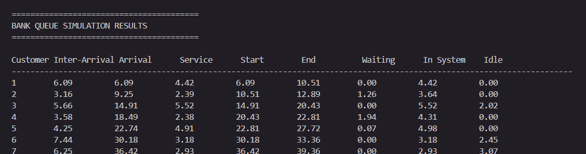
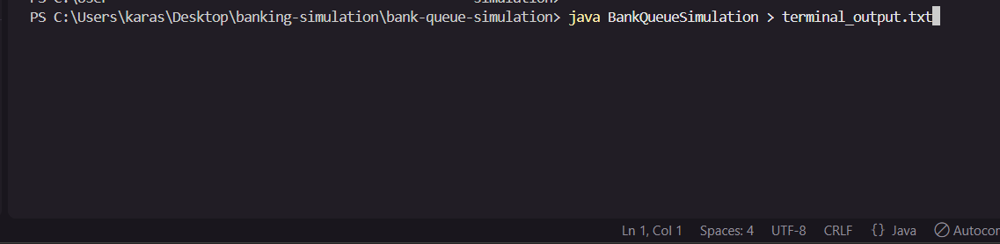
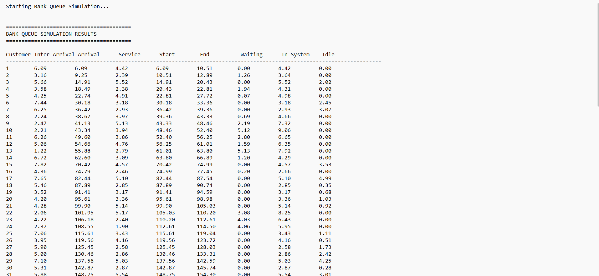
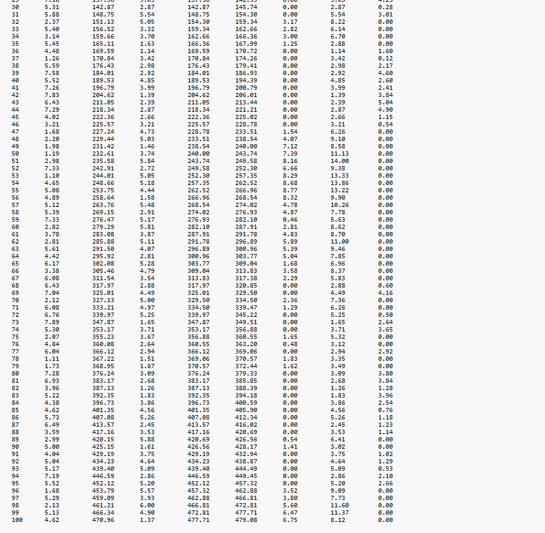
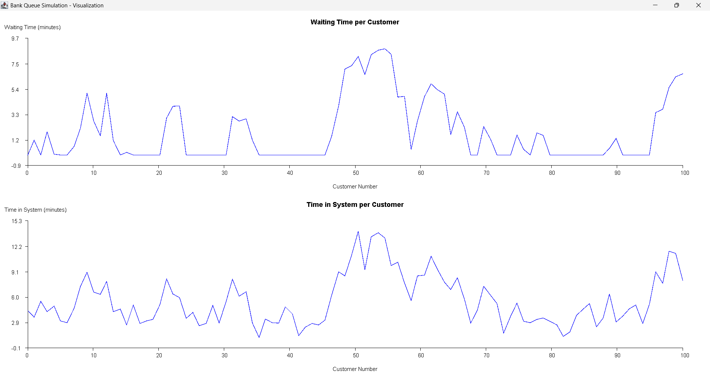

# Bank Queue Simulation

## Group Members

- Ray Lukorito - 168110
- Andrew Karanja - 167144
- Matthew Wachira - 151733

## Assignment Description

This project implements a single-server bank queue simulation system that models customer arrivals, queueing, and service at a bank facility. The simulation generates 100 customers with random inter-arrival times and service times, computes customer-level queue metrics, and produces summary statistics to evaluate the performance of the banking system.

The simulation uses:

- **Inter-arrival times:** Uniformly distributed between 1 and 8 minutes
- **Service times:** Uniformly distributed between 1 and 6 minutes
- **Number of customers:** 100
- **Random seed:** 42, used to make the simulation results reproducible

Results are presented through:

1. Formatted terminal output showing customer-level results and summary statistics
2. CSV file export named `simulation_results.csv`
3. Java Swing visualization with line graphs
4. Screenshots showing the program output, CSV results, and graph visualization

---

## Simulation Logic

The simulation follows discrete-event queueing principles for a single-server banking system.

### Customer Arrival

Each customer has a randomly generated inter-arrival time.

```text
Arrival Time = Previous Arrival Time + Inter-Arrival Time
```

### Service Scheduling

Only one customer can be served at a time. Therefore, if a customer arrives while the server is busy, the customer waits in the queue.

```text
Service Start Time = max(Arrival Time, Previous Service End Time)
```

This means:

- If the server is free, service starts immediately.
- If the server is busy, service starts after the previous customer finishes.

### Queue Formulas

For each customer:

```text
Arrival Time = Previous Arrival Time + Inter-Arrival Time

Service Start Time = max(Arrival Time, Previous Service End Time)

Service End Time = Service Start Time + Service Time

Waiting Time = Service Start Time - Arrival Time

Time in System = Waiting Time + Service Time

Server Idle Time = max(0, Arrival Time - Previous Service End Time)
```

Where:

- **Waiting Time** is the time a customer spends in the queue before service begins.
- **Time in System** is the total time a customer spends in the bank.
- **Server Idle Time** is the time the server is free before the next customer arrives.

---

## Queue Statistics Computed

The program computes the following queue statistics:

1. **Total Simulation Time**  
   The service end time of the last customer.

2. **Total Waiting Time**  
   The sum of all customer waiting times.

3. **Average Waiting Time**  
   Total waiting time divided by the number of customers.

4. **Total Service Time**  
   The sum of all customer service times.

5. **Average Service Time**  
   Total service time divided by the number of customers.

6. **Average Time in System**  
   The average total time a customer spends in the bank.

7. **Total Server Idle Time**  
   The total time the server remains idle during the simulation.

8. **Server Utilization**  
   The percentage of total simulation time during which the server is busy.

   ```text
   Server Utilization = (Total Service Time / Total Simulation Time) × 100
   ```

9. **Probability That a Customer Waits**  
   The proportion of customers whose waiting time is greater than zero.

10. **Maximum Waiting Time**  
    The longest time any customer waits in the queue.

11. **Maximum Time in System**  
    The longest total time any customer spends in the bank.

12. **Average Number of Customers in Queue**  
    Calculated using Little’s Law:

```text
Average Customers in Queue = Total Waiting Time / Total Simulation Time
```

13. **Average Number of Customers in System**  
    Calculated as:

```text
Average Customers in System = Total Time in System / Total Simulation Time
```

---

## How to Compile and Run

### Prerequisites

- Java Development Kit (JDK) 8 or higher
- Terminal, Command Prompt, VS Code terminal, or Kiro terminal

### Compilation

```bash
cd bank-queue-simulation
javac BankQueueSimulation.java
```

### Execution

```bash
java BankQueueSimulation
```

When the program runs, it will:

1. Display a table of all 100 customers in the terminal
2. Display summary queue statistics
3. Generate `simulation_results.csv`
4. Open a Java Swing visualization window with graphs

### Saving Terminal Output to a Text File

The terminal output can also be saved to a text file using:

```bash
java BankQueueSimulation > terminal_output.txt
```

This is useful because the full terminal output is long.

---

## Screenshots

### Terminal Output Header

This screenshot shows the start of the terminal output, including the table header and customer-level simulation results.



### Saving Output as a Text File

This screenshot shows the terminal output being saved to a text file.



### Simulation Results - First Rows

This screenshot shows the first part of the generated simulation results.



### Simulation Results - Remaining Rows

This screenshot shows the remaining part of the generated simulation results.



### Summary Statistics

This screenshot shows the summary statistics generated by the simulation.


### Java Swing Graph Output

This screenshot shows the Java Swing visualization with graphs for the simulation results.



---

## Visualization

The Java Swing visualization displays two line graphs.

### 1. Waiting Time per Customer

- X-axis: Customer number
- Y-axis: Waiting time in minutes
- Shows how long each customer waited before service began
- Helps identify periods where the queue became congested

### 2. Time in System per Customer

- X-axis: Customer number
- Y-axis: Time in system in minutes
- Shows the total time each customer spent in the bank
- Combines both waiting time and service time

The visualization helps show:

- Queue congestion trends
- Customer waiting patterns
- Variability in customer experience
- Relationship between waiting time and total time in the system

---

## Example Summary Output

```text
========================================
SUMMARY STATISTICS
========================================

Total Simulation Time:           479.08 minutes
Total Waiting Time:              191.53 minutes
Average Waiting Time:              1.92 minutes
Maximum Waiting Time:              8.77 minutes
Maximum Time in System:           14.00 minutes
Avg Customers in Queue:            0.40
Avg Customers in System:           1.17

========================================
```

---

## CSV Output

The program generates a CSV file named:

```text
simulation_results.csv
```

The CSV file contains customer-level simulation results with the following columns:

- Customer Number
- Inter-Arrival Time
- Arrival Time
- Service Time
- Service Start Time
- Service End Time
- Waiting Time
- Time in System
- Server Idle Time

This file can be opened in Excel, Google Sheets, or any spreadsheet software for further analysis.

---

## Project Structure

```text
bank-queue-simulation/
├── README.md
├── BankQueueSimulation.java
├── BankQueueSimulationTest.java
├── simulation_results.csv
├── SUMMARY.md
└── screenshots/
    ├── graph-output.png
    ├── terminal-output.png
    ├── saving-out-as-txt.png
    ├── simulationresults1.png
    ├── simulationresults2.png
    └── simulationresults.png
```

---

## Implementation Details

- **Programming Language:** Java
- **Libraries Used:** Java standard library only
- **Visualization:** Java Swing
- **Random Seed:** 42
- **Number of Customers:** 100
- **Output Formatting:** Values rounded to 2 decimal places
- **CSV Export:** Generated automatically when the program runs

---

## Optional Testing

The project also includes an optional test file:

```text
BankQueueSimulationTest.java
```

To compile and run the tests:

```bash
javac BankQueueSimulationTest.java
java BankQueueSimulationTest
```

The tests validate key correctness properties of the queue simulation logic, including arrival time calculation, service start time, waiting time, service end time, server idle time, and summary statistic consistency.

---

## Notes

- The simulation is deterministic because it uses a fixed random seed.
- All time values are measured in minutes.
- The CSV file is overwritten each time the program runs.
- The Java Swing graph window should be closed after viewing the visualization.
- The screenshots provide evidence that the program compiles, runs, generates output, saves results, and displays the graph.
